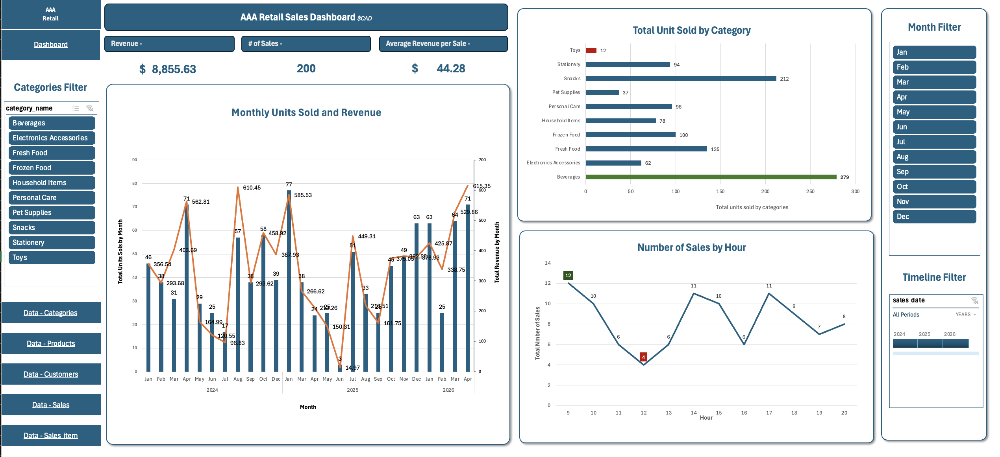

# Retail Sales Analytics Dashboard

An interactive retail sales dashboard built in **Excel** using **Power Query**, **Power Pivot**, and **PivotTables** to analyze retail sales performance across products, categories, and time periods.

> This project demonstrates data modeling, data transformation, KPI reporting, and dashboard design using Excel's business intelligence tools.

---

## Project Overview

This project simulates a retail sales analytics solution by transforming transactional data into an interactive dashboard for business reporting.

The dashboard enables users to explore sales performance through dynamic filters, KPIs, and visualizations that support data-driven analysis.

---

## Business Questions

This dashboard helps answer questions such as:

- Which product categories generate the most sales?
- How do sales and revenue change over time?
- What are the busiest sales hours?
- What are the overall sales KPIs?

---

## Tools

- Microsoft Excel
- Power Query
- Power Pivot
- PivotTables
- PivotCharts

---

## Dashboard Features

- KPI Summary
  - Revenue
  - Number of Sales
  - Average Revenue per Sale

- Monthly Sales & Revenue Trend
- Units Sold by Category
- Number of Sales by Hour
- Interactive Category Slicer
- Timeline Filter

---

## Skills Demonstrated

- Data Modeling
- Data Cleaning & Transformation
- Dashboard Development
- KPI Reporting
- Data Visualization
- Business Analytics

---

## Dashboard Preview

